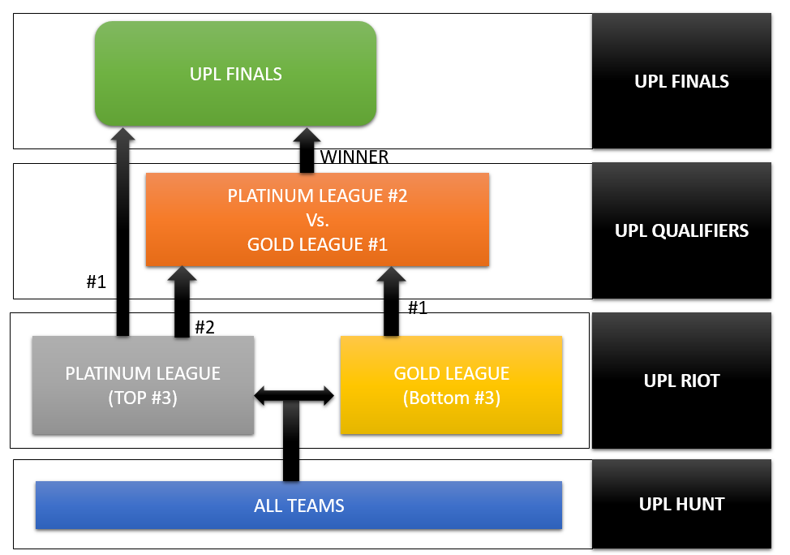

## UPL Format (New)
Starting UPL 15 we are introducing a new format encouraging participation and competitiveness
throughout the tournament.

UPL will be divided into leagues –
1. Platinum league
2. Gold League

Winners of each league will be competing in the UPL finals for the championship.
SchedulesUPL scheduling is divided into four parts1. UPL Hunt
2. UPL Riot
3. UPL Qualifiers
4. UPL championship

**UPL HUNT** – All the participating teams will be playing one-match with each other to qualify into
the corresponding leagues viz. Platinum and Gold

**UPL RIOT**- Teams within each league will be competing between each other (Number of matches
to be decided later).
i. Number #1 team from Platinum league will be qualifying directly to the UPL Finals.
ii. Number #2 team will be qualifying to the UPL QUALIFIERS.
iii. Only Number #1 team for Gold league will be qualifying to the UPL QUAIFIERS.

**UPL QUAIFIERS**- Number #2 team from Platinum league and Number #1 team from Gold league
will be competing for reaching the UPL Finals

**UPL FINALS**- UPL Champions will be decided in this round

